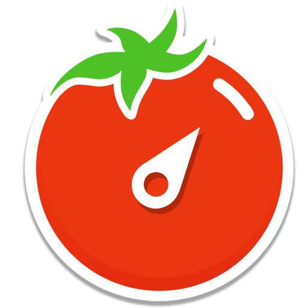
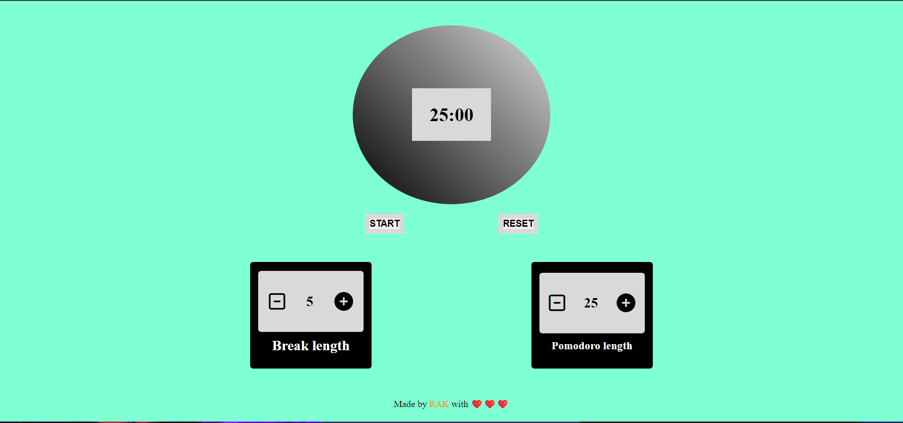
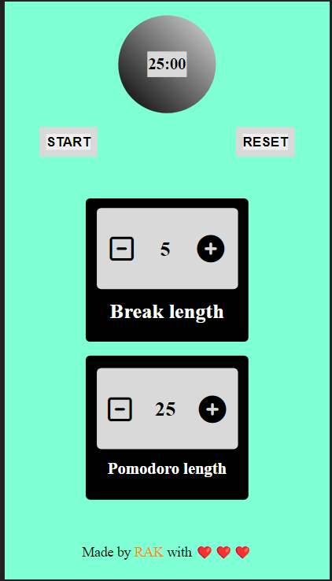

      <h1>  FocusBurst</h1>
     

     

# Description
FocusBurst is a dynamic Pomodoro app designed to help you maximize your productivity and achieve laser-like focus

# Features
- Customizable Work Sessions: Set your preferred duration for focused work sessions, allowing you to personalize the Pomodoro technique to suit your needs.

- Break Management: Define the duration of your breaks between work sessions, enabling you to recharge and maintain a healthy work-life balance.
# Screenshots
  
 
# Tech Used
    
      

<!-- </> with 💛 by readMD (https://readmd.itsvg.in) -->
    
